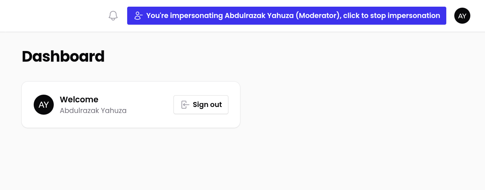

# 🎭 Filament Impersonate

A plugin for [Filament Admin Panel](https://filamentphp.com/) that allows authorized users to impersonate other users.

---

## 📦 Installation

```bash
composer require abdullyahuza/filament-impersonate
```

Optionally publish the config file:

```bash
php artisan vendor:publish --tag="filament-impersonate-config"
```

---

## ⚙️ Configuration

Inside `config/filament-impersonate.php`:

```php
return [

    'redirect_after_impersonation' => 'filament.app.pages.dashboard',

    'guard' => 'web',

    'user_model' => \App\Models\User::class,

    'session_key' => 'filament_impersonator_id',

    'excluded_user_ids' => [/* user IDs that should never be impersonated */],

    'allowed_environments' => ['local', 'staging', 'production'],

    'display_name_resolver' => fn ($user) => $user->name ?? 'Unknown User',

    'can_impersonate_resolver' => fn ($user) => $user?->hasRole('admin') || $user?->can('impersonate users'),

];
```
### Setup Filament-Impersonate
#### Install for Panel
```code
->plugins([
	...
	FilamentImpersonate::make(),
])
```

```code
->middleware([
	...
	// AuthenticateSession::class,
	ImpersonateSessionMiddleware::class,
])
```
---

## ✅ Usage

### Impersonate a user

1. From the Filament UI, click the impersonation button shown next to user profile (if allowed).
2. You will be logged in as that user.
3. A banner or button will appear indicating impersonation — click it to stop impersonating.

### Stop impersonating

Click the **"Stop Impersonating"** button to return to your original user session.

---

## 🔐 Permissions

To restrict who can impersonate users, configure the `can_impersonate_resolver` in your config file.

Example:

```php
'can_impersonate_resolver' => fn ($user) => $user?->hasRole('admin') || $user?->can('impersonate_users'),
```

---

## 💾 Session Management

During impersonation, the following is stored in the session:

- Impersonator ID
- Original user roles & permissions (if applicable)

These are restored when impersonation is stopped.

---

## 🛡️ Notes

- Only users not in `excluded_user_ids` can be impersonated.
- Impersonation only works in environments defined in `allowed_environments`.
- You can customize how user names are displayed using `display_name_resolver`.

---

## 🧪 Testing

Ensure your environment is included in `allowed_environments` for local testing.

```php
'allowed_environments' => ['local'],
```

---

## 📄 License
MIT
